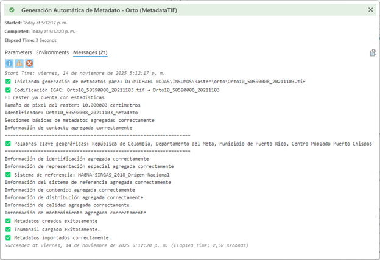

# Generaci-n-Automatica-de-Metadatos-MDT-Ortioimagenes-ArcGIS-Pro

## Descripción
Este proyecto automatiza la generación de metadatos para Modelos Digitales de Terreno (MDT) y Ortoimágenes utilizando la librería ArcPy y los estándares internacionales de metadatos geográficos (ISO 19115 e ISO 19139). Incluye configuraciones específicas de la organización, palabras clave relacionadas con temas geoespaciales, exportación en formato XML, creación de miniaturas (thumbnails) y generación de PDF del metadato.

El script está diseñado para facilitar la documentación de datos geoespaciales, asegurando cumplimiento con estándares internacionales y personalización según necesidades organizacionales.

## Características
- **Automatización completa**: Genera metadatos para MDT y Ortoimágenes de manera automática.
- **Estándares ISO**: Utiliza namespaces definidos por ISO 19115 para manipulación de metadatos en XML.
- **Palabras clave predefinidas**: Incluye temas y categorías específicas para MDT y Ortoimágenes.
- **Exportación múltiple**: Soporta exportación a XML, creación de thumbnails y generación de PDF.
- **Personalizable**: Permite ajustar constantes de organización y palabras clave según sea necesario.

## Requisitos
- **Python**: Versión 3.x
- **ArcGIS**: Instalado y configurado correctamente (requiere ArcPy).
- **Entorno**: Compatible con Python y ArcPy (ej. entorno de ArcGIS Pro).

## Instalación
1. Asegúrese de tener ArcGIS instalado y configurado.
2. Clone o descargue el repositorio en su directorio local (ej. `z:\ESP\MODALIDAD\`).
3. Verifique que ArcPy esté disponible en su entorno Python.
4. No se requieren instalaciones adicionales, ya que el script utiliza librerías estándar y ArcPy.

## Uso
1. Abra el script `Generacion Metadatos.pyt` en un entorno compatible con ArcPy (ej. ArcGIS Pro).
2. Personalice las constantes y palabras clave en la sección de configuraciones si es necesario.
3. Ejecute el script proporcionando los datos de entrada (MDT u Ortoimágenes).
4. El script generará automáticamente los metadatos, incluyendo XML, thumbnail y PDF.

## Imágenes
Para visualizar el proceso, aquí se incluyen ejemplos de capturas de pantalla y diagramas. Almacena las imágenes en una carpeta `images/` dentro del proyecto para mantener la organización.

- **Captura de pantalla de la ejecución del script en ArcGIS Pro**:
  

- **Diagrama del flujo de generación de metadatos**:
  

- **Ejemplo de thumbnail generado**:
  

## Notas
- Este script utiliza namespaces definidos por ISO 19115 para la manipulación de metadatos en formato XML.
- Personalice las constantes de la organización y palabras clave según sus necesidades.
- Asegúrese de que los datos de entrada sean válidos y compatibles con ArcPy.

## Contribuyentes
- **Elaboró / Modificó**: MICHAEL ANDRES ROJAS RIVERA - YARITZA DORELY QUEVEDO TOVAR
- **Fecha de creación**: 02/05/2025
- **Última modificación**: 05/11/2025

## Licencia
Este proyecto se dedica al dominio público bajo la [Unlicense](https://unlicense.org/). Esto significa que no hay restricciones de copyright; puedes usar, modificar y distribuir el código libremente. Si prefieres una licencia más estructurada (como MIT o Apache 2.0), considera cambiarla según tus necesidades.
